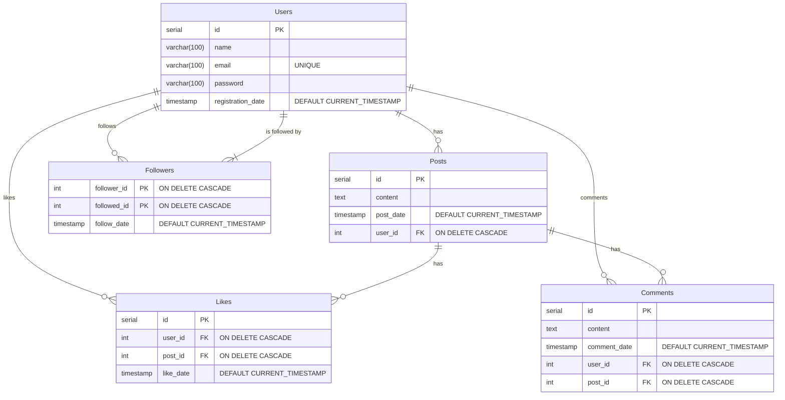

## Diagrama de Entidad-Relación (ERD)

```mermaid
erDiagram
    Users ||--o{ Posts : "has"
    Users ||--o{ Followers : "follows"
    Users ||--o{ Likes : "likes"
    Users ||--o{ Comments : "comments"
    Posts ||--o{ Likes : "has"
    Posts ||--o{ Comments : "has"
    Followers }|--|| Users : "is followed by"

    Users {
        serial id PK
        varchar(100) name
        varchar(100) email "UNIQUE"
        varchar(100) password
        timestamp registration_date "DEFAULT CURRENT_TIMESTAMP"
    }

    Posts {
        serial id PK
        text content
        timestamp post_date "DEFAULT CURRENT_TIMESTAMP"
        int user_id FK "ON DELETE CASCADE"
    }

    Followers {
        int follower_id PK "ON DELETE CASCADE"
        int followed_id PK "ON DELETE CASCADE"
        timestamp follow_date "DEFAULT CURRENT_TIMESTAMP"
    }

    Likes {
        serial id PK
        int user_id FK "ON DELETE CASCADE"
        int post_id FK "ON DELETE CASCADE"
        timestamp like_date "DEFAULT CURRENT_TIMESTAMP"
    }

    Comments {
        serial id PK
        text content
        timestamp comment_date "DEFAULT CURRENT_TIMESTAMP"
        int user_id FK "ON DELETE CASCADE"
        int post_id FK "ON DELETE CASCADE"
    }
```